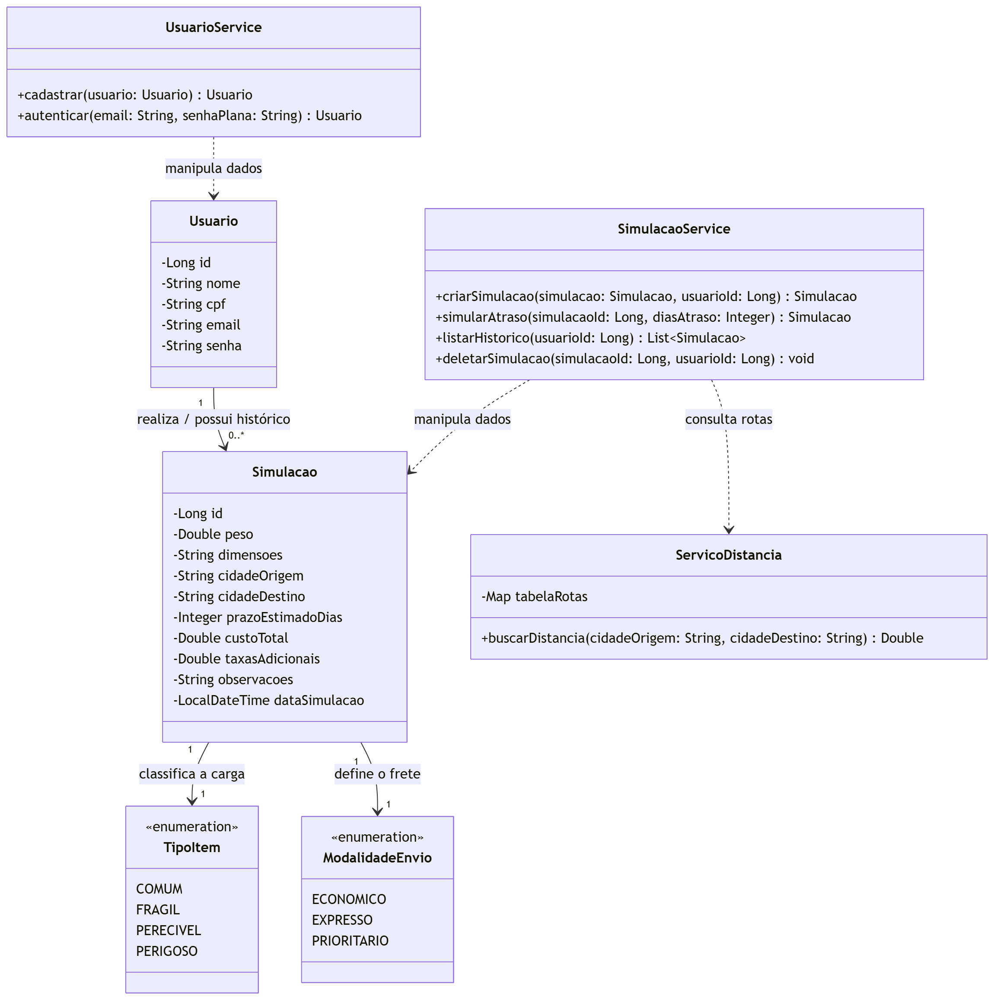

# Simulador de Frete QA

Projeto acadêmico desenvolvido para a disciplina de Testes de Software do curso de Engenharia da Computação do **Instituto Federal da Paraíba (IFPB)**.

O sistema consiste em uma aplicação backend via CLI (Command Line Interface) focada no cálculo e simulação logística de fretes, precificação e regras de negócio. O projeto foi construído com forte ênfase na **Pirâmide de Testes** e em boas práticas de Engenharia de Software.

---

## Tecnologias e Arquitetura

O sistema foi arquitetado em camadas (Model, Repository, Service, CLI), utilizando o ecossistema Spring:

* **Linguagem:** Java 21
* **Framework:** Spring Boot 3.5.15 (Spring Data JPA)
* **Banco de Dados:** H2 Database (In-Memory) para rápido setup e testes isolados.
* **Segurança:** `jBCrypt` para geração de Hash e proteção de senhas.
* **Garantia de Qualidade (QA):**
    * **JUnit 5 & Mockito:** Para testes unitários isolados da camada de Serviço.
    * **Cucumber & Spring Boot Test:** Para testes de integração orientados a comportamento (BDD) validando todo o contexto (Mocks + Banco H2).
* **Gerenciador de Dependências:** Maven Wrapper (`mvnw`)


* **Diagrama de Classes:**


---

## Funcionalidades Principais (Casos de Uso)

1. **Gestão de Acesso Seguro:** Cadastro de usuários validando duplicidade (LGPD/CPF) e autenticação protegida por BCrypt.
2. **Motor de Preços:** Cálculo de prazo e custo baseado em origem, destino, peso, tipo de carga (Comum, Frágil, Perecível, Perigosa) e modalidade (Econômico, Expresso, Prioritário).
3. **Simulador de Exceções:** Sistema de injeção de atrasos logísticos que aplica descontos (Multa SLA) automáticos ou anula custos em caso de perda de cargas perecíveis.
4. **Conformidade LGPD:** Histórico individualizado de simulações com exclusão permanente de registros do banco de dados.

---

## Como Executar a Aplicação

Não é necessário instalar ferramentas além do Java, pois o projeto conta com o Maven Wrapper.

1. Clone o repositório para sua máquina:
   ```bash
   git clone https://github.com/tacitojuno/simulador-frete-qa.git
   ```

2. Acesse a pasta do projeto:
   ```bash
   cd simulador-frete-qa
   ```

3. Inicie o sistema:
   ```bash
   ./mvnw spring-boot:run
   ```
   *(No Windows, você pode usar `.\mvnw spring-boot:run`)*

4. Siga as instruções do Menu CLI interativo no terminal.

---

## Como Executar a Suíte de Testes

O projeto possui uma cobertura rigorosa com **15 testes automatizados** (10 Unitários focados em segurança e regras de atraso + 4 Integrações/BDD focados no motor matemático + 1 Context Load do Spring).

Para rodar a bateria completa e visualizar o relatório de sucesso (BUILD SUCCESS), execute:

```bash
./mvnw clean test
```

### Relatório de Cenários Cobertos

**Testes de Integração (BDD / Cucumber):**
*  `CT001` - Calcular frete econômico com sucesso
*  `CT002` - Simular envio com Item Perigoso e frete Expresso
*  `CT003` - Impedir simulação com peso negativo (Regra de Negócio)
*  `CT004` - Impedir simulação para cidade não atendida (Validação de Rota)

**Testes Unitários (JUnit / Mockito):**
*  `CT005` - Aplicar multa SLA ao sistema quando houver atraso de item comum
*  `CT006` - Zerar custo compulsoriamente quando atraso de carga perecível passar do limite
*  `CT007` - Lançar exceção e bloquear dias de atraso negativos
*  `CT008` - Cadastrar usuário com sucesso e validar criptografia da senha
*  `CT009` - Lançar exceção ao tentar cadastrar e-mail já existente
*  `CT010` - Autenticar usuário com sucesso verificando hash BCrypt
*  `CT011` - Lançar exceção e bloquear login ao autenticar com senha incorreta
*  `CT012` - Listar histórico completo de simulações do usuário logado
*  `CT013` - Excluir simulação específica do histórico (Conformidade LGPD)
*  `CT014` - Lançar exceção ao tentar excluir simulação inexistente

---

*IFPB - Campus Campina Grande | Semestre 2026.1*